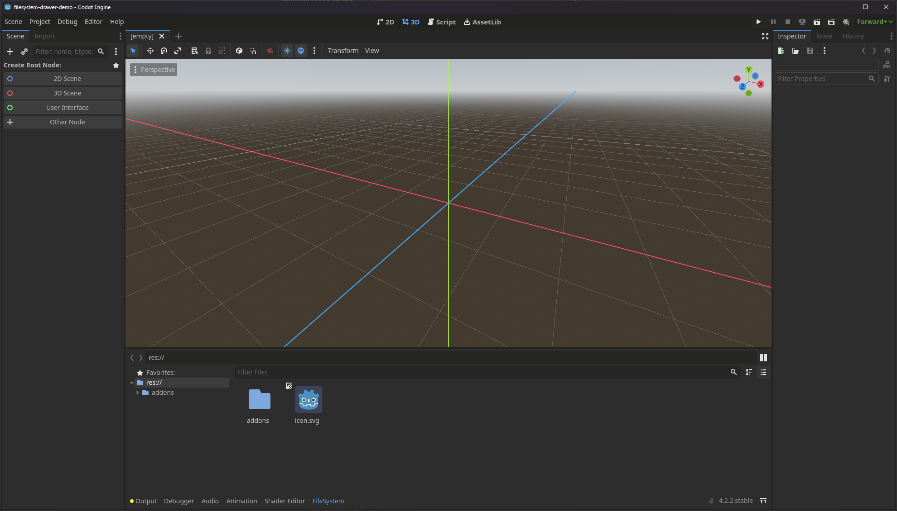
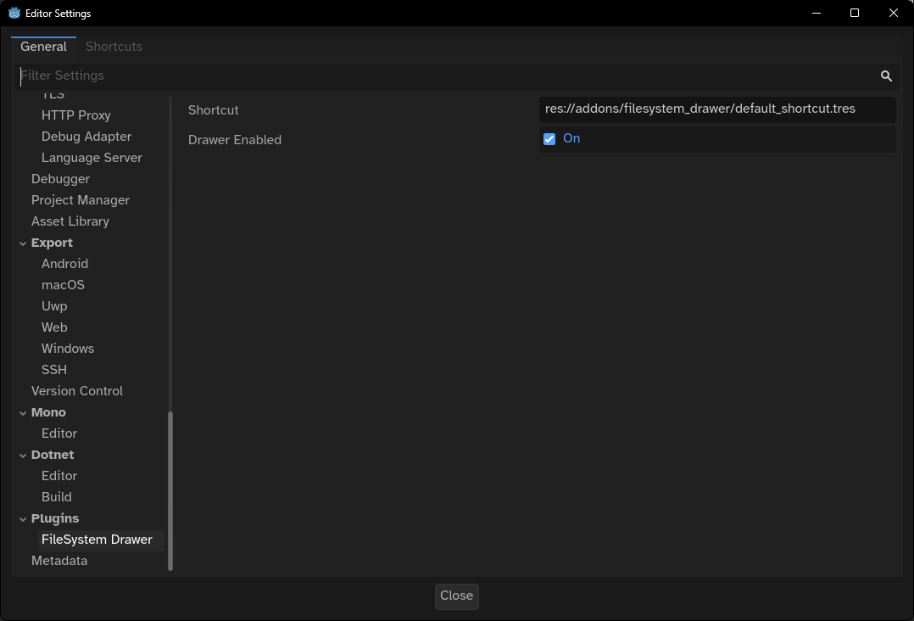

# Godot FileSystem Drawer

> [!WARNING]
> This plugin is not necessary since the release of [Godot 4.3](https://godotengine.org/releases/4.3/#editor-filesystem-moved-bottom-screen), as it's now a [native feature](https://github.com/godotengine/godot/pull/86765). I will no longer update this plugin.

A simple plugin for the Godot editor that moves the **FileSystem** dock to the bottom of the editor, similar to Unreal Engine's Asset Drawer. Click on the **FileSystem** button at the bottom of the window or use <kbd>Ctrl</kbd>+<kbd>Space</kbd> to open it. Inspired by [@newjoker6's plugin](https://github.com/newjoker6/Asset-Drawer/).

## Installation

### From GitHub Releases

- Download the [latest release](https://github.com/jakobbouchard/godot-filesystem-drawer/releases/latest)
- Extract the `addons` folder into your project
- Open the **Project Settings** (`Project → Project Settings...`) and go to the **Plugins** tab
- Enable **FileSystem Drawer**

### From Asset Library

- Open the **Asset Library** tab in your editor
- Search for `FileSystemDrawer` and download it
- Open the **Project Settings** (`Project → Project Settings...`) and go to the **Plugins** tab
- Enable **FileSystem Drawer**

## Settings

Open your **Editor Settings** (`Editor → Editor Settings...`) and scroll down to **Plugins → FileSystem Drawer**. You will be able to choose between having the drawer enabled or not (for example when working with multiple people in a project). You can also change the `Shortcut` resource that is associated with the plugin. Currently, Godot has no way for plugins to register shorcuts in the **Shortcuts** tab, so this is the workaround, [as noted here](https://github.com/godotengine/godot-proposals/issues/2024#issuecomment-1378782833).

